# WorkoutTracker: AI-Powered Fitness Ecosystem 🏋️‍♂️🧠


**WorkoutTracker** is a state-of-the-art, fully native iOS & watchOS fitness application. It transcends traditional rep-counting by integrating **Generative AI**, **Custom CoreML Computer Vision**, and **Biometric HealthKit Analysis** to act as a truly intelligent personal trainer.

🔗 **Part of a unified ecosystem:** WorkoutTracker works in seamless synergy with its sister application, [FoodTracker](https://github.com/Borisserz/FoodTracker), providing a complete 360-degree view of your health, nutrition, and physical performance.

---

## 📸 Application Gallery

<table align="center">
  <tr>
    <td align="center"><b>Dashboard & Biometrics</b></td>
    <td align="center"><b>Neural AI Coach</b></td>
    <td align="center"><b>Smart Anatomy Heatmap</b></td>
  </tr>
  <tr>
    <td>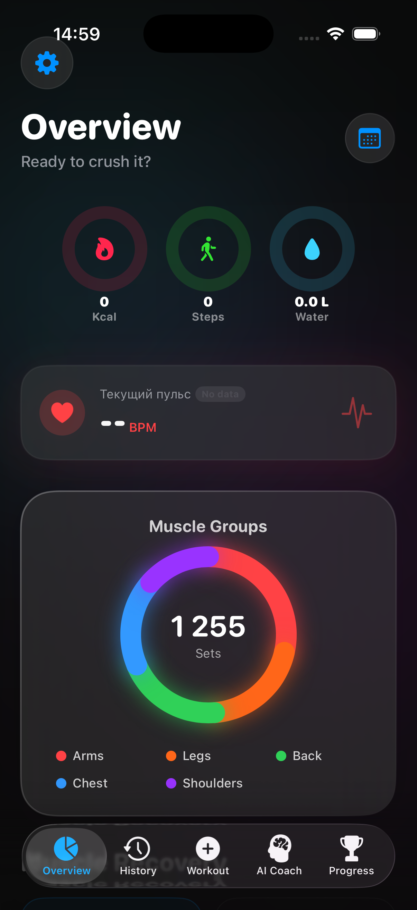</td>
    <td>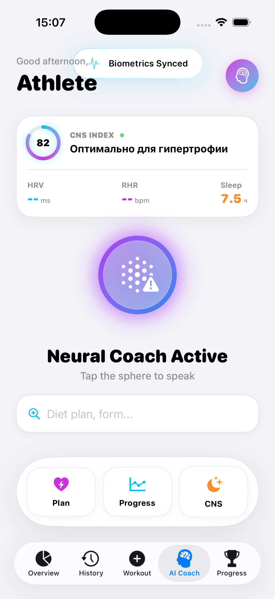</td>
    <td>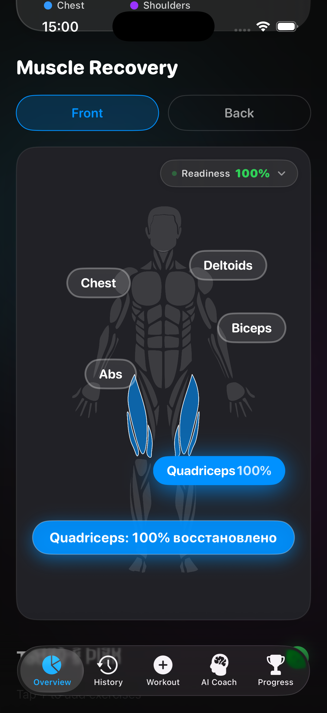</td>
  </tr>
  <tr>
    <td align="center"><b>Workout Hub</b></td>
    <td align="center"><b>AI Program Architect</b></td>
    <td align="center"><b>Legendary Routines</b></td>
  </tr>
  <tr>
    <td>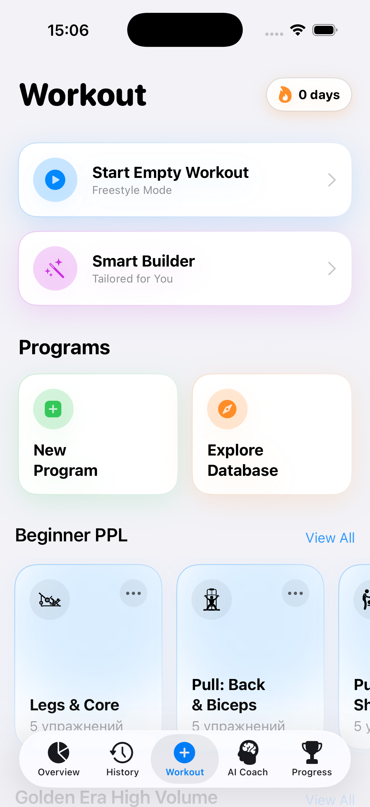</td>
    <td>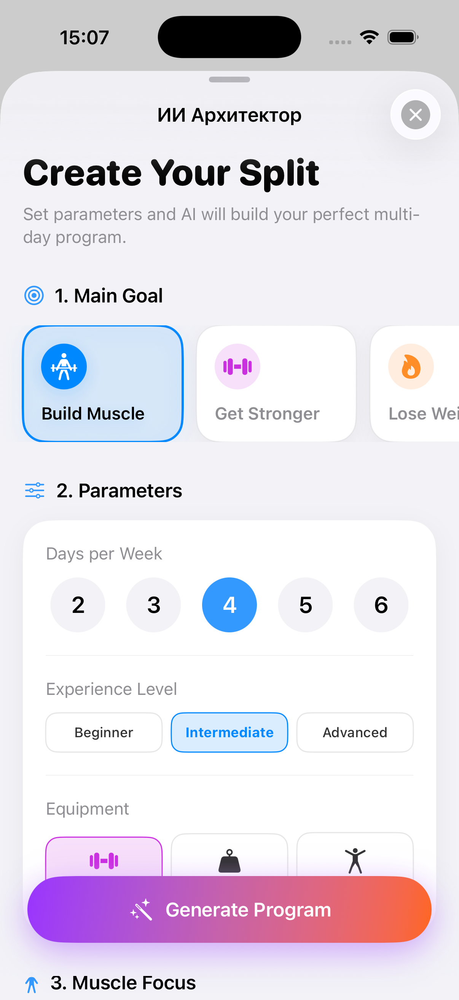</td>
    <td>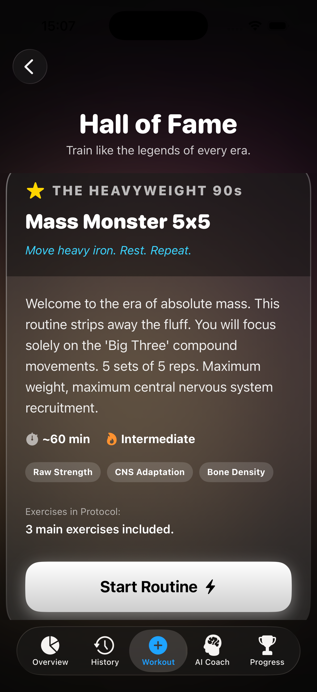</td>
  </tr>
  <tr>
    <td align="center"><b>Advanced Stats & Radar</b></td>
    <td align="center"><b>Progress & Predictions</b></td>
    <td align="center"><b>Live Workout Analytics</b></td>
  </tr>
  <tr>
    <td>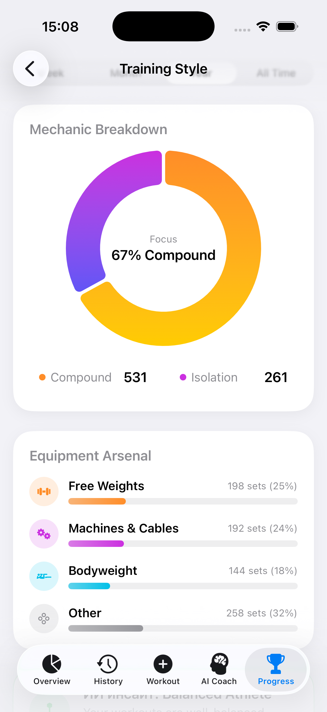</td>
    <td>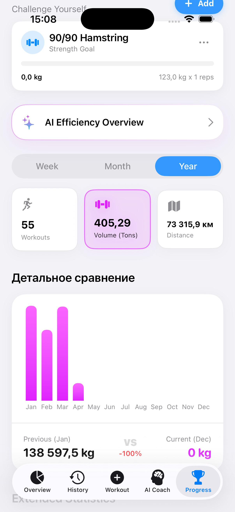</td>
    <td>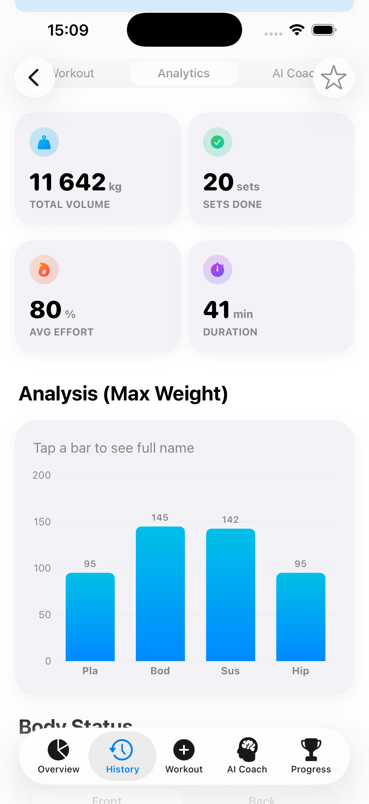</td>
  </tr>
  <tr>
    <td align="center"><b>Mechanics Breakdown</b></td>
    <td align="center"><b>Extended Comparisons</b></td>
    <td align="center"><b>Social Share Cards</b></td>
  </tr>
  <tr>
    <td>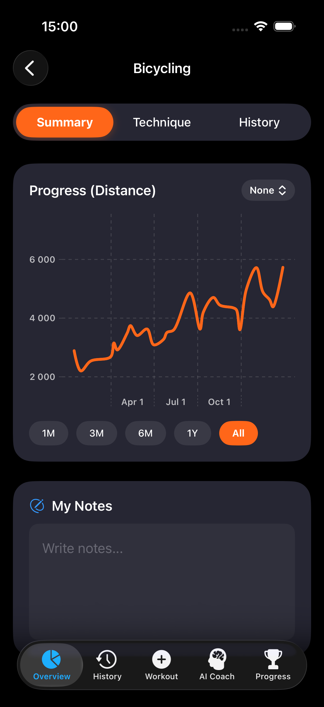</td>
    <td>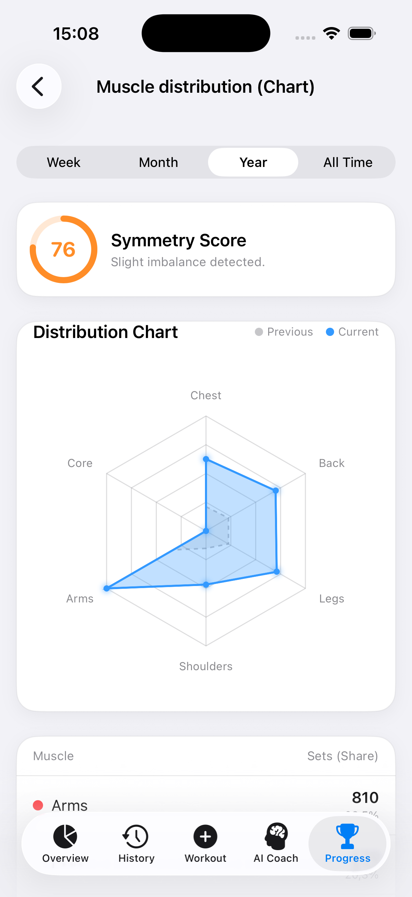</td>
    <td></td>
  </tr>
</table>

---

## 🌟 Core Features

### 👁️ Custom CoreML & Computer Vision Tracking

- **Action Classification Model:** Uses a custom-trained `.mlmodel` integrated with an `MLMultiArray` prediction window (60 frames buffered). The AI natively understands if you are performing a rep or just resting.
- **Live Pose Estimation:** Utilizes `VNHumanBodyPoseObservation` to track skeletal mechanics and biomechanical angles (e.g., knee-to-hip depth) in real-time.
- **Velocity Based Training (VBT):** Detects if your bar speed drops significantly during a set and triggers auditory warnings before failure.
- **Gesture Controls:** Complete a set by showing a "Victory" (✌️) sign, or cancel tracking with an "Open Palm" (✋) using `VNHumanHandPoseObservation`.

### 🧠 Generative AI Neural Coach (Gemini API)

- **Smart Program Architect:** The AI analyzes your available equipment, days per week, and target muscles to instantly generate structured multi-day splits.
- **In-Workout Proactive Adjustments:** Chat with the coach mid-workout. Machine taken? Too heavy? The AI instantly swaps exercises or drops the load, natively altering the app's database state.
- **Savage AI Roasts:** Ask the AI to roast your form or effort after a heavy set for a dose of gamified, PG-13 motivation.

### 🍎 FoodTracker Synergy & Ecosystem

- **Two-App Ecosystem:** Deeply integrated with [FoodTracker](https://github.com/Borisserz/FoodTracker). Calories burned during heavy lifting in WorkoutTracker are instantly reflected in FoodTracker's daily allowance via Apple Health.
- **Hydration Impact:** WorkoutTracker reads water intake logged in FoodTracker to calculate your true CNS recovery score.
- **Seamless Deep Linking:** Jump instantly between tracking your macros in FoodTracker and hitting the iron in WorkoutTracker using custom URL schemes (`foodtracker://`).

### ⚡ CNS Fatigue & Biometric Analysis

- **HealthKit Integration:** Reads Sleep Analysis, Resting Heart Rate (RHR), and Heart Rate Variability (HRV) from Apple Health to calculate a real-time **Central Nervous System (CNS) Index**.
- **Anatomical Heatmap:** A custom SVG parser renders a highly detailed male/female muscular system. Muscles dynamically glow red/orange/green based on 48h-96h volume decay and RPE exhaustion.

### 📊 Advanced Data Analytics

- **1RM Prediction Engine:** Uses Epley, Brzycki, and Lander formulas combined with linear regression to forecast your 1RM gains over 30/90 days.
- **Symmetry & Radar Charts:** Detects muscular imbalances (e.g., "Too much push, not enough pull") and renders beautiful Swift Charts to visualize mechanic breakdowns.

### ⌚ watchOS Companion App

- **Real-time Sync:** Uses `WatchConnectivity` to stream live Heart Rate to the iPhone dashboard and sync active workout states instantly.
- **Standalone Tracking:** Log sets, adjust weights via the Digital Crown, and finish workouts directly from your wrist while the iPhone stays in your locker.

### 🎮 RPG-Style Gamification & Achievements

- **Leveling System:** Earn XP based on workout volume and effort to level up your fitness rank (e.g., Novice, Iron Apprentice, Gym Titan).
- **Dynamic Achievements:** Unlock Bronze to Diamond tier badges for hitting milestones (e.g., 1000 tons lifted, 365-day streaks, early bird workouts).
- **Streak Protection:** Interactive mascot and push notifications warn you before neurological detraining begins.

### 🏝️ Live Activities, Dynamic Island & Widgets

- **ActivityKit Integration:** Live tracking of workout duration and active exercise directly on the Lock Screen and Dynamic Island.
- **Interactive Widgets:** Home Screen and Lock Screen widgets for quick access to your current streak, daily activity rings, and instant AI Coach status.

### 🌍 Production-Ready Localization

- Fully localized in **English** and **Russian** using Apple's modern `.xcstrings` catalog, dynamically adapting not just UI text, but AI Coach prompts and SVG anatomy labels.

---

## 🛠 Technical Architecture

This project strictly adheres to modern Apple development paradigms, prioritizing performance, safety, and scalable code design.

- **UI/UX:** 100% `SwiftUI`. Built with reusable components, custom ViewModifiers for Glassmorphism, 3D Parallax button effects, and rich `Swift Charts`.
- **Architecture:** Clean **MVVM** architecture combined with Apple's pure `Observation` framework (`@Observable`) for reactive state management.
- **Data Persistence:** `SwiftData` utilized with background `@ModelActor` operations. Heavy analytical calculations, JSON parsing, and DB migrations never block the Main Thread.
- **Concurrency:** Fully migrated to **Swift 6 Strict Concurrency** (`async/await`, `TaskGroups`, `Actors`, `Sendable` compliance), completely eliminating legacy GCD closures.
- **Machine Learning Pipeline:** Pure `Vision` framework for skeletal tracking + `CoreML` sequential windowing buffers to process time-series movement data smoothly.
- **Media & Export:** `AVFoundation` for camera buffer extraction, audio ducking, and Voice TTS. Custom `VideoExportService` to render dynamic heatmaps into MP4 shareable videos using `AVAssetWriter`.

---

## 🚀 Installation & Setup

To compile and run this project, you will need **macOS Sonoma/Sequoia** and **Xcode 15.0+** (iOS 17.0+ Simulator or Physical Device required for SwiftData and Vision features).

1. **Clone the repository:**

   ```bash
   git clone https://github.com/Borisserz/WorkoutTracker.git
   ```

2. **Configure the AI API Key:**
   Locate `Secrets.swift` in the `AppCore` directory and insert your Google Gemini API Key:

   ```swift
   enum Secrets {
       static let geminiApiKey = "YOUR_GEMINI_API_KEY_HERE"
   }
   ```

3. **Configure App Groups (Important for Widgets & WatchOS):**
   Open `WorkoutTracker.xcodeproj`. In the _Signing & Capabilities_ tab for all targets (App, Widget, WatchApp), ensure the App Group (`group.com.yourname.WorkoutTracker`) matches your Apple Developer account.

4. **Build and Run:**
   Select a physical iPhone (Highly recommended to test CoreML Computer Vision and HealthKit integration) and press `Cmd + R`.

---

## 📜 License & Copyright

Copyright (c) 2026 [Boris Serzhanovich]. All rights reserved.

This project is showcased for **portfolio and demonstration purposes only**. The source code, UI designs, and custom SVG anatomical models are proprietary. They are not licensed for public, commercial use, redistribution, or modification without explicit written permission from the author.
