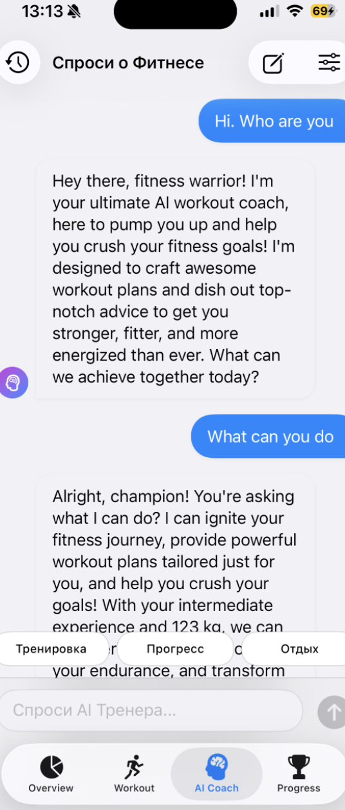
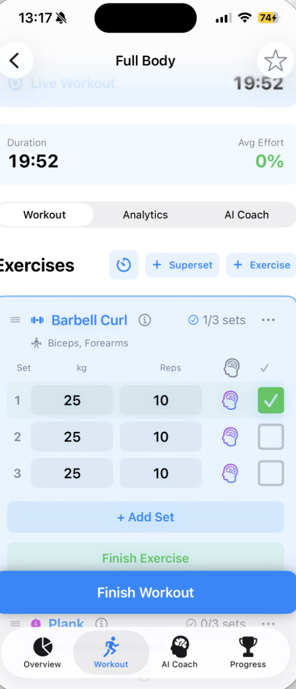
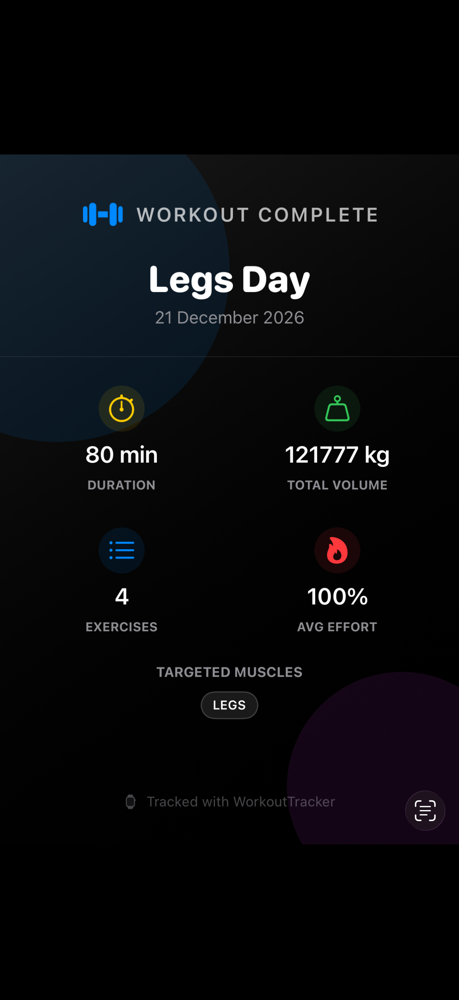

# WorkoutTracker 🏋


**WorkoutTracker** is a professional, AI-powered iOS application designed for physical activity monitoring, in-depth progress analytics, and muscle group recovery visualization. 

Going beyond standard tracking, the app features a **Generative AI Coach** (powered by Gemini) and **Real-Time Computer Vision** to automatically count reps, analyze form, and control the app using hand gestures.

---

## App Screenshots

<table>
  <tr>
    <td align="center"><b>Dashboard & Heatmap</b></td>
  <td align="center"><b>Live Activity</b></td>
    <td align="center"><b>Generative AI Coach</b></td>
  </tr>
  <tr>
    <td></td>
    <td></td>
    <td></td>
  </tr>
  <tr>
    <td align="center"><b>Active Workout & Live Activity</b></td>
    <td align="center"><b>Progress Analytics</b></td>
    <td align="center"><b>Social Share Cards</b></td>
  </tr>
  <tr>
    <td></td>
    <td></td>
    <td></td>
  </tr>
</table>

---

## Core Features

### 1. AI-Powered Rep Tracking (CoreML & Vision)
* **Real-time Pose Estimation:** Utilizes `VNHumanBodyPoseObservation` to track body mechanics, automatically counting reps for exercises like Squats, Bicep Curls, and Bench Presses.
* **Gesture Controls:** Hands-free workout management. Show a "Victory" (✌️) gesture to complete a set or an "Open Palm" (✋) to cancel, powered by custom hand-pose heuristics.
* **Voice Coach:** Integrated `AVSpeechSynthesizer` smoothly ducks background music (Spotify/Apple Music) to speak your reps and provide audio feedback ("Ready. Let's go!").
* **Live Muscle Tension:** The anatomical heatmap updates in real-time, highlighting the specific muscles engaged during the current camera-tracked movement.

### 2. Generative AI Coach (Gemini API)
* **Smart Workout Builder:** Ask the AI to build a routine (e.g., "I have 45 mins and dumbbells, hit my chest") and instantly convert it into a trackable workout.
* **In-Workout Adjustments:** Chat with the AI during your workout to swap exercises, drop weight, or add sets. The AI directly modifies your live workout state.
* **Weekly Performance Reviews:** The AI analyzes your volume, PRs, and weak points over the last 7 days to generate personalized markdown reports.
* **Proactive Feedback:** Hits a new PR? The AI automatically congratulates you and provides form tips based on the exact exercise.

### 3. Smart Body Heatmap
* **Custom Rendering:** Utilizes a proprietary SVG path parser to render interactive male and female anatomical models.
* **Fatigue & Recovery:** Muscles are dynamically shaded based on cumulative training volume, RPE (Effort), and time decay (48h-96h recovery windows).

### 4. Advanced Tracking & Analytics
* **Rich Data Input:** Streamlined input for weights, reps, distance, time, and RPE. Full support for supersets and circuits.
* **Body Measurements:** Track weight, biceps, chest, waist, and more with interactive `Swift Charts`.
* **Progress Forecasting:** Linear regression algorithms predict future 1RM metrics over 30/90 day periods.
* **Weak Point Analysis:** Identifies under-trained muscle groups and suggests frequency or volume adjustments.

### 5. Gamification & Ecosystem
* **Live Activities & Dynamic Island:** Real-time rest timers and workout status right on the Lock Screen.
* **Achievements System:** Unlockable badges (Bronze to Diamond) with custom confetti animations and shareable Image-Rendered social cards.
* **Widgets:** Home screen widgets displaying weekly consistency and current streaks.

---

## Technical Stack

Built with a strict adherence to modern Apple development paradigms:

* **UI Framework:** 100% `SwiftUI` with custom view modifiers and advanced animations.
* **Data Persistence:** `SwiftData` with background `@ModelActor` operations to prevent main-thread blocking and OOM crashes during heavy analytical calculations.
* **Machine Learning:** `Vision` framework for pose estimation and `CoreML` for custom action classification windowing.
* **Concurrency:** Swift 6 Concurrency (`async/await`, `Task`, `Actor`, `Sendable` structs) replacing GCD.
* **State Management:** Clean `MVVM` Architecture, utilizing `Combine` for debounced search and sensor updates.
* **System Integrations:** `ActivityKit` (Live Activities), `WidgetKit`, `AVFoundation` (Audio session management for Voice Coach), and `PhotosUI`.
* **Localization:** Fully localized in English and Russian via `Localizable.xcstrings`.

---

##  Installation & Setup

To run this project, you will need **macOS** and **Xcode 15.0+** (iOS 17.0+ Simulator/Device required for SwiftData and Vision features).

1. **Clone the repository:**
   ```bash
   git clone https://github.com/Borisserz/WorkoutTracker.git

2. **Setup API Keys:**
   Locate `Secrets.swift` in the project and add your Google Gemini API Key:
   ```swift
   enum Secrets {
       static let geminiApiKey = "YOUR_API_KEY_HERE"
   }
3. **Configure Signing:**
   Open `WorkoutTracker.xcodeproj`, select your Apple ID in the target settings, and ensure the App Group (`group.com.borisdev.WorkoutTracker`) matches your developer account for WidgetKit support.

4. **Run:**
   Select a physical device (recommended for Camera/Vision features) or simulator and press `Cmd + R`.


## License & Copyright

Copyright (c) 2026 [Boris Serzhanovich]. All rights reserved.

This project is for portfolio demonstration purposes only. The source code is not licensed for public or commercial use, redistribution, or modification without explicit permission from the author.


