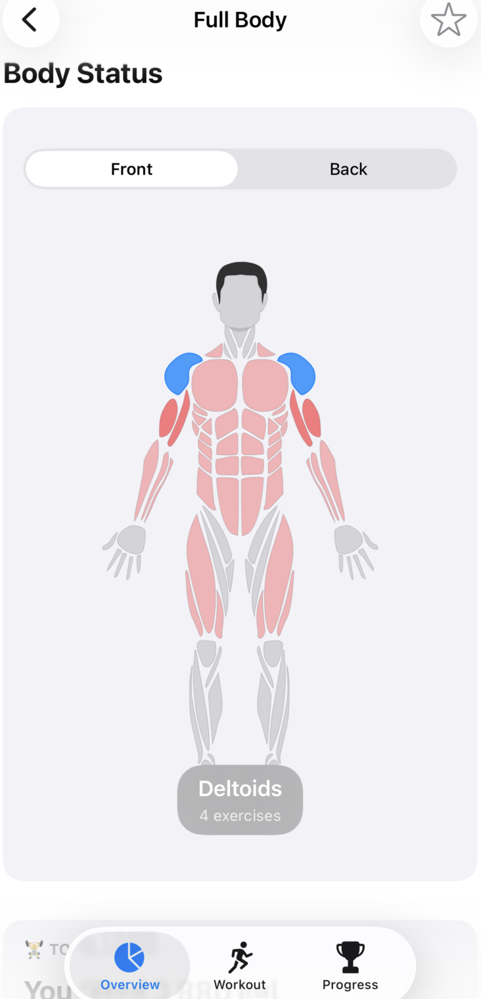
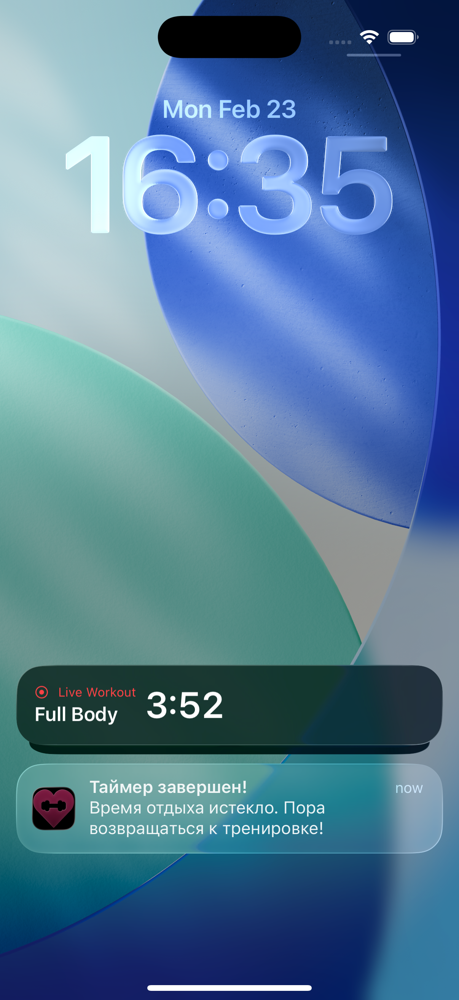
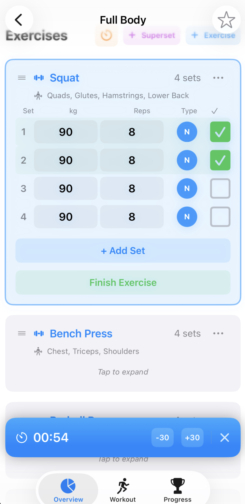
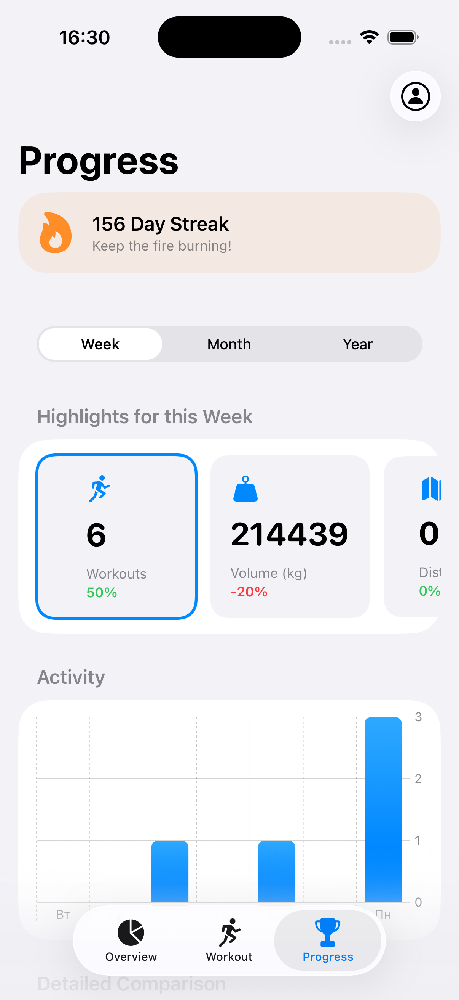
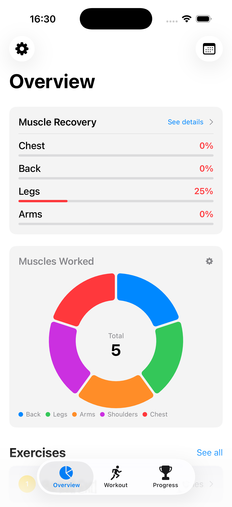
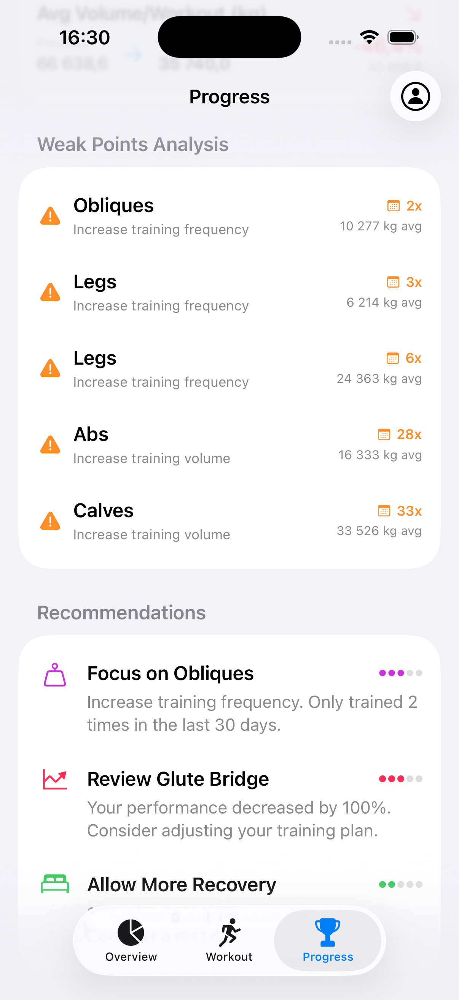

# WorkoutTracker


**WorkoutTracker** is a professional iOS application designed for physical activity monitoring, in-depth progress analytics, and muscle group recovery visualization. The project leverages modern Apple technologies (Live Activities, ActivityKit) combined with own engineering solutions, such as a own SVG parser.

---

## App Screenshots

<table>
  <tr>
    <td align="center"><b>Dashboard & Heatmap</b></td>
    <td align="center"><b>Live Activity</b></td>
    <td align="center"><b>Active Workout</b></td>
  </tr>
  <tr>
    <td></td>
    <td></td>
    <td></td>
  </tr>
  <tr>
    <td align="center"><b>Progress Analytics</b></td>
    <td align="center"><b>Muscle Recovery</b></td>
    <td align="center"><b>Recomendations</b></td>
  </tr>
  <tr>
    <td></td>
    <td></td>
    <td></td>
  </tr>
</table>

---

## Core Features

### 1. Smart Body Heatmap
* **Custom Rendering:** Utilizes a proprietary SVG path parser to render an interactive anatomical model.
* **Dynamic Indicators:** Muscles are shaded in various gradients based on cumulative training volume and current fatigue levels.
* **Gender Models:** Supports toggling between male and female anatomical models.

### 2. Advanced Workout Tracking
* **Real-time Logging:** Streamlined input for weights, repetitions, and RPE (Rate of Perceived Exertion).
* **Supersets:** Ability to group exercises into supersets or circuits.
* **Ghost Text:** Hints from previous sessions for every set to help maintain progressive overload.
* **Rest Timer:** Interactive floating timer with quick adjustment controls (+30/-30 sec).

### 3. iOS Ecosystem Integration (Live Activities & Widgets)
* **Dynamic Island:** Workout status and rest timers are displayed in the "Island" on iPhone 14 Pro and newer.
* **Lock Screen Widgets:** View current progress at a glance without unlocking the device.
* **Home Screen Widgets:** Dedicated widgets for workout streaks and activity charts.

### 4. Deep Analytics
* **Weak Point Analysis:** The system automatically identifies under-trained muscle groups based on the last 30 days of history.
* **Progress Forecasting:** Utilizes linear regression algorithms to predict future strength metrics (1RM).
* **Weight History:** Built-in body mass tracker with intuitive trend charts.
* **Interactive Calendar:** Visualizes workout frequency and consistency by month.

### 5. Gamification
* **XP & Levels:** Experience point system awarded for every completed workout.
* **Achievements:** Over 20 unlockable achievements (from "First Step" to "100kg Club").
* **Streaks:** Tracks training regularity to boost user motivation.

---

## Technical Stack

* **SwiftUI:** Entire UI is built using a declarative approach.
* **Combine:** Reactive data processing, including debounce implementation to minimize disk I/O when saving notes.
* **ActivityKit & WidgetKit:** Powering Live Activities and Home/Lock Screen widgets.
* **Swift Charts:** Complex visualizations for load distribution and weight history.
* **Foundation (JSON/Codable):** Robust local data storage system (Privacy First) without external database dependencies.
* **MVVM:** Clean architecture with a strict separation between business logic and views.

---

## Installation & Setup

To run this project, you will need **macOS** and **Xcode 15.0+**.

1. **Clone the repository:**
   ```bash
   git clone https://github.com/Borisserz/WorkoutTracker.git
   ```
2. **Open the project:**
   Locate `WorkoutTracker.xcodeproj` in the project folder and launch it.
3. **Configure Signing & Capabilities:**
   Select your Apple ID in the target settings to enable running the app on a physical device or simulator.
4. **Run:**
   Select a simulator (iPhone 14 or newer is recommended for Dynamic Island support) and press `Cmd + R`.

---

## Data Import & Export
The app supports full data portability:
* **Export:** Save your entire history in JSON or CSV formats.
* **Templates:** Share workout plans via custom Deep Links (URL Schemes).
* **Backups:** Built-in automated local backup system.

---

## ⚖️ License & Copyright

Copyright (c) 2025 [Boris Serzhanovich]. All rights reserved.

This project is for portfolio demonstration purposes only. The source code is not licensed for public or commercial use, redistribution, or modification without explicit permission from the author.
