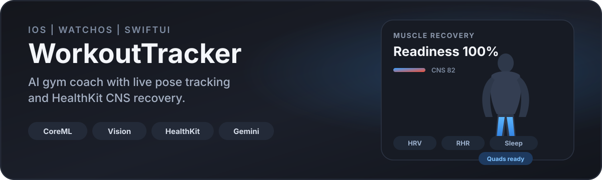
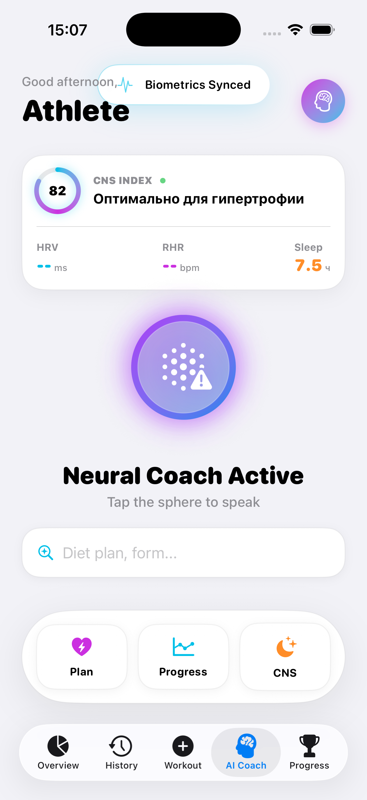
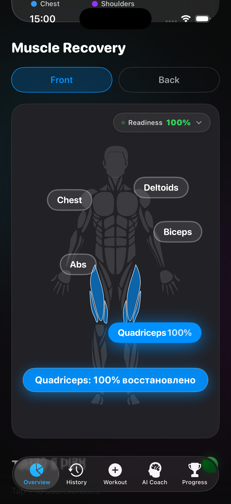
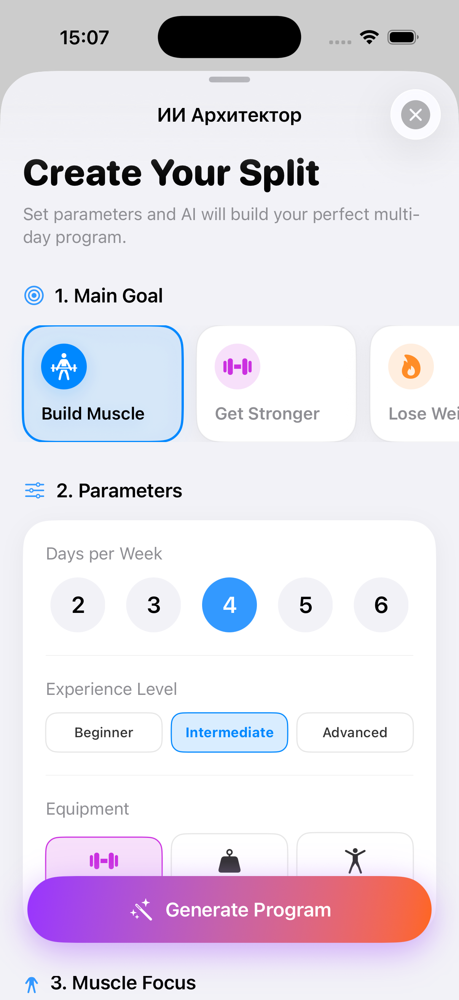
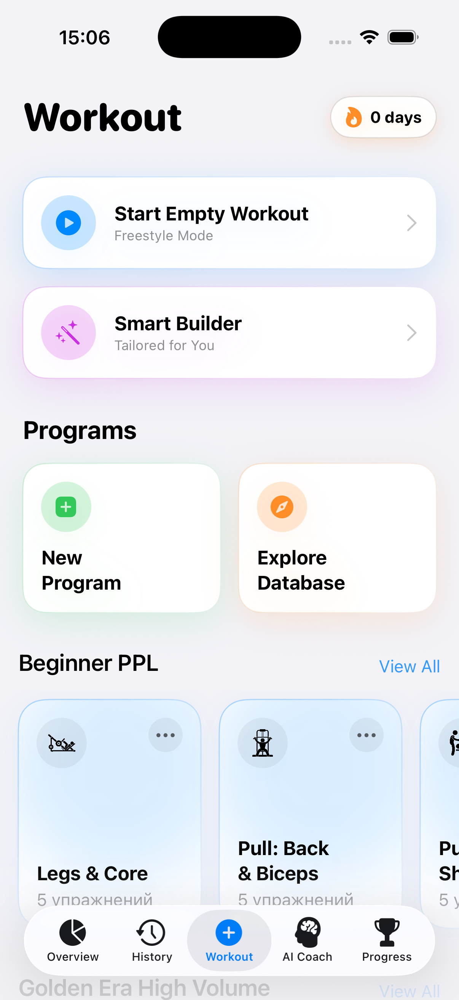

<p align="center">
  
</p>

<p align="center">
  <a href="https://apps.apple.com/us/app/ai-workout-coach-gym-tracker/id6774895106">
    
  </a>
</p>

<p align="center">
  <a href="https://apps.apple.com/us/app/ai-workout-coach-gym-tracker/id6774895106"><strong>App Store</strong></a>
  ·
  <a href="https://github.com/Borisserz/FoodTracker">FoodTracker</a>
  ·
  <a href="https://apps.apple.com/us/developer/barys-serzhanovich/id6774895109">Developer</a>
</p>

**WorkoutTracker** is a native iOS & watchOS gym app: CoreML pose tracking, HealthKit CNS recovery, and a Gemini coach that can rewrite today’s session mid-workout.

---

## Screenshots

<p align="center">
  
  
  
  
</p>

---

## What it does

| Area | What you get |
| --- | --- |
| **Live tracking** | Custom CoreML action classifier + Vision body/hand pose for reps, depth, VBT cues, and gesture controls |
| **Recovery** | CNS index from sleep, RHR, and HRV; anatomical heatmap with 48–96h volume decay |
| **AI coach** | Gemini builds multi-day splits and swaps exercises when equipment or load changes |
| **Apple stack** | watchOS companion, Live Activities / Dynamic Island, Home Screen widgets |
| **Ecosystem** | Shares App Group + Health with [FoodTracker](https://github.com/Borisserz/FoodTracker) so training burn feeds daily energy |

---

## Stack

`SwiftUI` · `SwiftData` · `Observation` · `Swift 6` · `Vision` · `CoreML` · `HealthKit` · `WatchConnectivity` · `ActivityKit` · `Swift Charts` · Gemini API

Localized in **English** and **Russian** (`.xcstrings`).

---

## Build locally

Requires **Xcode 15+**, **iOS 17+** (device recommended for Vision / HealthKit).

```bash
git clone https://github.com/Borisserz/WorkoutTracker.git
cd WorkoutTracker
```

1. Add a local `Secrets.swift` (gitignored) with your Gemini key:

```swift
enum Secrets {
    static let geminiApiKey = "YOUR_GEMINI_API_KEY_HERE"
}
```

2. In Signing & Capabilities, set App Group `group.com.borisdev.WorkoutTracker` on App, Widget, and Watch targets (or your own group ID).
3. Select a physical iPhone and run (`Cmd+R`).

---

## License

Copyright (c) 2026 Boris Serzhanovich. All rights reserved.

Portfolio / demonstration only. Source, UI, and custom anatomy assets are proprietary — no public commercial use, redistribution, or modification without written permission.
